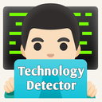

# Website Technology Detector Extension

A browser extension that detects technologies, servers, and other technical details of websites you visit. Works with Chrome, Firefox, and other Chromium-based browsers.

## Features

- 🕵️‍♂️ Detects over 20 categories of technologies including:
  - Frontend frameworks (React, Vue, Angular, Svelte, etc.)
  - CSS frameworks (Bootstrap, Tailwind)
  - Backend technologies
  - Server information
  - Analytics and tracking tools
  - Payment gateways
  - Social media integrations
  - And much more!

- 🔍 Comprehensive detection methods:
  - Script analysis
  - DOM inspection
  - Header examination
  - WHOIS lookups
  - DNS information

- 📊 Clean, organized interface with icons and version information
- ⚡ Fast detection with minimal performance impact
- 🔄 Real-time updates as you browse

## Installation

### Chrome/Edge/Brave (Chromium-based browsers)

1. Download the latest release from the [Releases page](https://github.com/r3dhulk/website-technology-detector/releases)
2. Unzip the downloaded file
3. Go to `chrome://extensions` in your browser
4. Enable "Developer mode" (toggle in top right)
5. Click "Load unpacked" and select the unzipped folder

### Firefox

1. Download the latest release from the [Releases page](https://github.com/r3dhulk/website-technology-detector/releases)
2. Go to `about:debugging#/runtime/this-firefox` in Firefox
3. Click "Load Temporary Add-on"
4. Select the manifest.json file from the downloaded folder

*Note: For permanent installation in Firefox, you'll need to get the extension signed by Mozilla.*

## Usage

1. Click the extension icon in your browser toolbar
2. Click "Start Detection" to analyze the current page
3. View the detected technologies organized by category
4. Click any technology for more details (where available)

## Screenshots

*The extension popup showing detected technologies*

*Detailed technology information*

## Development

To build or modify the extension:

1. Clone this repository
2. Install dependencies (if any)
3. Make your changes
4. Test by loading the extension in your browser (see Installation above)

### File Structure

/
├── icons/ # Extension icons
├── background.js # Background script for detection
├── popup.js # Popup UI logic
├── popup.html # Popup UI
├── manifest.json # Extension manifest
└── README.md # This file
text

## License

This project is licensed under the GPT-3.0 License - see the [LICENSE](LICENSE) file for details.

## Contributing

Contributions are welcome! Please open an issue or pull request for any bugs or feature requests.

## Known Limitations

- Some detections may be blocked by site security policies
- WHOIS data requires internet connection
- Version detection isn't possible for all technologies

## Related Projects

- [Wappalyzer](https://www.wappalyzer.com/) - Similar technology detection
- [BuiltWith](https://builtwith.com/) - Website technology profiling

## Support

If you find this extension useful, consider starring the repository or donating to support development.

